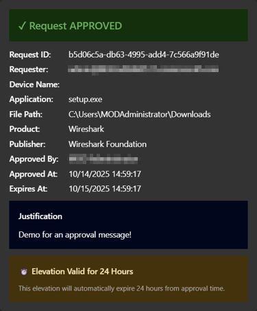
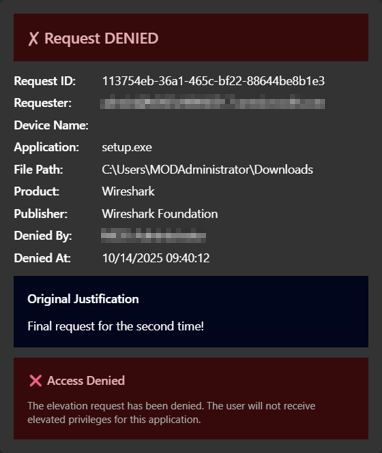

# EPM Approval Workflow - Logic App with Teams Integration

## Overview

This solution automates **Endpoint Privilege Management (EPM) approval workflows** using Azure Logic Apps and Microsoft Teams. When elevation requests require approval in Microsoft Intune, an Adaptive Card is automatically posted to a Teams channel, allowing approvers to approve or deny requests directly from Teams.


## Screenshots

|  |  |


## Architecture

```
┌─────────────────────────────────────────────────────────────────┐
│                    EPM Approval Workflow                         │
└─────────────────────────────────────────────────────────────────┘

1. Logic App (Recurrence Trigger - every 5 minutes)
        │
        ├──> GET Microsoft Graph API
        │    /deviceManagement/elevationRequests
        │
        ├──> Filter requests with status = "supportApproved"
        │
        ├──> For each approved request:
        │    └──> Post Adaptive Card to Teams channel
        │         ├──> Approve button
        │         └──> Deny button
        │
        └──> When button clicked:
             └──> PATCH elevation request via Graph API
```

## Features

- **Automated Polling**: Checks for new EPM elevation requests every 5 minutes
- **Teams Integration**: Posts Adaptive Cards with rich request details
- **One-Click Approval**: Approve or deny requests directly from Teams
- **Managed Identity**: Secure authentication to Microsoft Graph API
- **Least Privilege**: Uses minimal required Graph API permissions
- **Monitoring**: Integrated diagnostics with Log Analytics
- **Secure by Design**: No secrets stored, outputs secured

## Prerequisites

### Azure Resources
- Azure subscription with permissions to create:
  - Resource Groups
  - Logic Apps
  - Managed Identities
  - API Connections
- Log Analytics Workspace (optional, for diagnostics)

### Microsoft 365 & Intune
- Microsoft Intune subscription with EPM configured
- Microsoft Teams with a dedicated channel for approvals
- Global Administrator or Intune Administrator role

### Tools
- Azure CLI or Azure PowerShell
- Bicep CLI (version 0.20.0 or later)
- Visual Studio Code with Bicep extension (recommended)

## Deployment Steps

### Step 1: Get Teams IDs

1. **Get Teams Team ID**:
   - Open Microsoft Teams
   - Click the "..." menu next to your team name
   - Select "Get link to team"
   - Extract the `groupId` from the URL:
     ```
     https://teams.microsoft.com/l/team/19%3a...%40thread.tacv2/conversations?groupId=TEAM_ID&tenantId=...
     ```

2. **Get Teams Channel ID**:
   - Right-click the channel name
   - Select "Get link to channel"
   - Extract the channel ID from the URL (URL decoded portion after `/channel/`)

### Step 2: Configure Parameters

Edit `main.bicepparam` and update:

```bicep
# Required Parameters
param teamsTeamId = 'YOUR_TEAMS_TEAM_ID'
param teamsChannelId = 'YOUR_TEAMS_CHANNEL_ID'

# OAuth Authentication (optional - defaults to current tenant)
param tenantId = ''  # Leave empty to use deployment tenant
param graphApiAudience = 'https://graph.microsoft.com'  # Default, usually no change needed

# Diagnostics (optional)
param logAnalyticsWorkspaceId = '/subscriptions/.../workspaces/YOUR_WORKSPACE'
```

**Note on OAuth Authentication**: The Logic App uses Azure AD OAuth with the Managed Identity to authenticate to Microsoft Graph API. The `tenantId` parameter defaults to your current deployment tenant, and `graphApiAudience` should remain as `https://graph.microsoft.com` unless you have specific requirements.

### Step 3: Deploy the Solution

The deployment script automates everything:

```powershell
# Run the automated deployment script
.\deploy.ps1

# Optional: Specify custom resource group and location
.\deploy.ps1 -ResourceGroupName "rg-epm-approval" -Location "westeurope"

# Optional: Skip Graph API permissions (for manual setup later)
.\deploy.ps1 -SkipGraphPermissions

# Optional: Preview changes without deploying
.\deploy.ps1 -WhatIf
```

The script will automatically:
1. Check prerequisites (Azure CLI, Bicep, login status)
2. Create the resource group if it doesn't exist
3. Deploy the Bicep template (Logic App, Managed Identity, API Connections)
4. Assign Microsoft Graph API permissions to the Managed Identity
5. Open browser for Teams connection authorization
6. Display deployment summary and next steps

**What happens during deployment:**

- **Graph API Permissions**: The script uses Microsoft Graph PowerShell to automatically assign:
  - `DeviceManagementConfiguration.ReadWrite.All` - To read and update elevation requests
  - `DeviceManagementManagedDevices.Read.All` - To read device information

- **Teams Connection**: The script opens a consent link in your browser where you must sign in to authorize the Teams connection with your account

### Step 4: Verify Deployment

After deployment completes, verify everything is set up correctly:
az login

# Set subscription
az account set --subscription "YOUR_SUBSCRIPTION_ID"

# Create resource group
az group create --name "rg-epm-approval" --location "eastus"

# Deploy the template
az deployment group create `
  --resource-group "rg-epm-approval" `
  --template-file "main.bicep" `
  --parameters "main.bicepparam"
```

### Step 4: Assign Graph API Permissions to Managed Identity

After deployment, assign the required Graph API permissions to the Managed Identity:

```powershell
# Get the output values
$principalId = az deployment group show `
  --resource-group "rg-epm-approval" `
  --name "main" `
  --query "properties.outputs.managedIdentityPrincipalId.value" `
  --output tsv

# Connect to Microsoft Graph
Connect-MgGraph -Scopes "Application.ReadWrite.All", "AppRoleAssignment.ReadWrite.All"

# Get Microsoft Graph Service Principal
$graphSP = Get-MgServicePrincipal -Filter "displayName eq 'Microsoft Graph'"

# Get the DeviceManagementConfiguration.ReadWrite.All permission
$permission = $graphSP.AppRoles | Where-Object { $_.Value -eq "DeviceManagementConfiguration.ReadWrite.All" }

# Assign the permission to the Managed Identity
New-MgServicePrincipalAppRoleAssignment `
  -ServicePrincipalId $principalId `
  -PrincipalId $principalId `
  -ResourceId $graphSP.Id `
  -AppRoleId $permission.Id
```

### Step 5: Authorize Teams Connection

1. Go to Azure Portal → Resource Groups → `rg-epm-approval`
2. Find the Logic App → API Connections → `teams-connection`
3. Click "Edit API connection"
4. Click "Authorize" and sign in with your Microsoft 365 account
5. Save the connection

### Step 6: Test the Workflow

1. Create an EPM elevation request in Intune that requires approval
2. Wait for the Logic App to run (check after 5 minutes)
3. Verify the Adaptive Card appears in your Teams channel
4. Click "Approve" or "Deny" to test the workflow

## Configuration

### Recurrence Interval

Change how often the Logic App checks for new requests:

```bicep
param recurrenceIntervalMinutes = 5  // Check every 5 minutes
```

### Graph API Version

By default, the beta endpoint is used (required for EPM):

```bicep
param graphApiBaseUrl = 'https://graph.microsoft.com/beta'
```

## Monitoring & Troubleshooting

### View Logic App Run History

```powershell
# Azure Portal
Navigate to: Logic App → Overview → Runs history

# Azure CLI
az logicapp show-run-history --resource-group "rg-epm-approval" --name "logic-epm-approval"
```

### Check Diagnostic Logs

```powershell
# In Log Analytics Workspace
AzureDiagnostics
| where ResourceType == "WORKFLOWS"
| where Resource == "logic-epm-approval"
| order by TimeGenerated desc
```

### Common Issues

| Issue | Solution |
|-------|----------|
| **No cards appearing in Teams** | Check Teams connection is authorized, verify Team/Channel IDs |
| **401 Unauthorized from Graph API** | Ensure Graph API permissions are assigned to Managed Identity |
| **Logic App not running** | Verify Logic App is enabled, check recurrence trigger |
| **Buttons not working** | Verify callback URL is accessible, check Logic App run history |

## Security Considerations

- **Managed Identity**: Uses Azure Managed Identity for authentication (no secrets)
- **Least Privilege**: Only requests `DeviceManagementConfiguration.ReadWrite.All`
- **Secure Outputs**: Sensitive data is marked with `@secure()` decorator
- **Audit Trail**: All approvals/denials are logged in Intune and Logic App run history
- **Network Security**: Consider using Private Endpoints for Logic Apps in production

## Graph API Permissions

| Permission | Type | Reason |
|------------|------|--------|
| `DeviceManagementConfiguration.ReadWrite.All` | Application | Read and update EPM elevation requests |

## Cost Estimate

| Resource | Tier | Estimated Cost |
|----------|------|----------------|
| Logic App (Consumption) | Pay-per-execution | ~$0.50/month (5-min intervals) |
| Managed Identity | Free | $0/month |
| Teams API Connection | Free | $0/month |
| Log Analytics (optional) | Pay-per-GB | ~$2-5/month |

**Total**: ~$2-6/month (varies by usage)

## Customization

### Adaptive Card Styling

Edit `workflow.json` to customize the Adaptive Card appearance:

```json
{
  "type": "TextBlock",
  "text": "Custom Title",
  "weight": "Bolder",
  "color": "Accent"
}
```

### Add Additional Actions

Add more actions to the workflow, such as:
- Send email notifications
- Log to Azure Monitor
- Update a SharePoint list
- Create a ticket in ServiceNow

## References

- [Microsoft Graph API - Elevation Requests](https://learn.microsoft.com/en-us/graph/api/resources/intune-rbac-elevationrequest)
- [Azure Logic Apps Documentation](https://learn.microsoft.com/en-us/azure/logic-apps/)
- [Adaptive Cards Documentation](https://adaptivecards.io/)
- [Endpoint Privilege Management](https://learn.microsoft.com/en-us/mem/intune/protect/epm-overview)

## Support

For issues or questions:
1. Check the [Troubleshooting](#monitoring--troubleshooting) section
2. Review Logic App run history in Azure Portal
3. Check Intune EPM logs
4. Open an issue in this repository

## License

This project is licensed under the MIT License.
